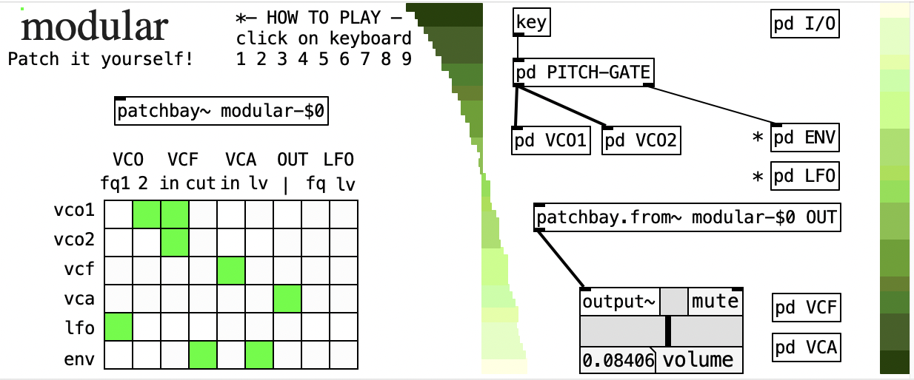
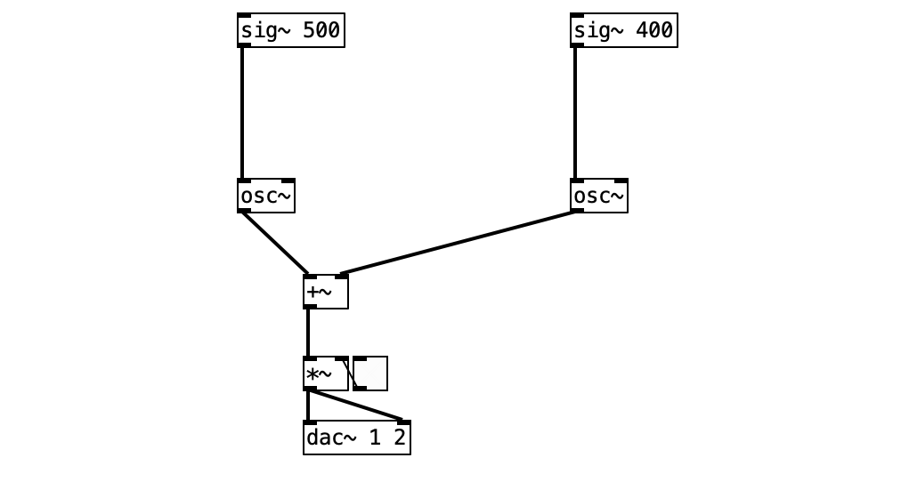
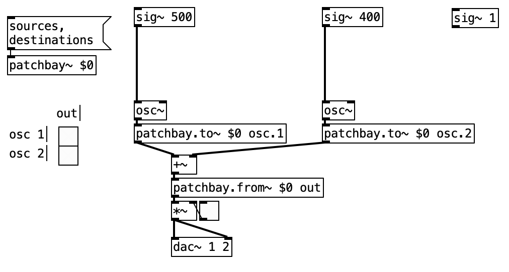
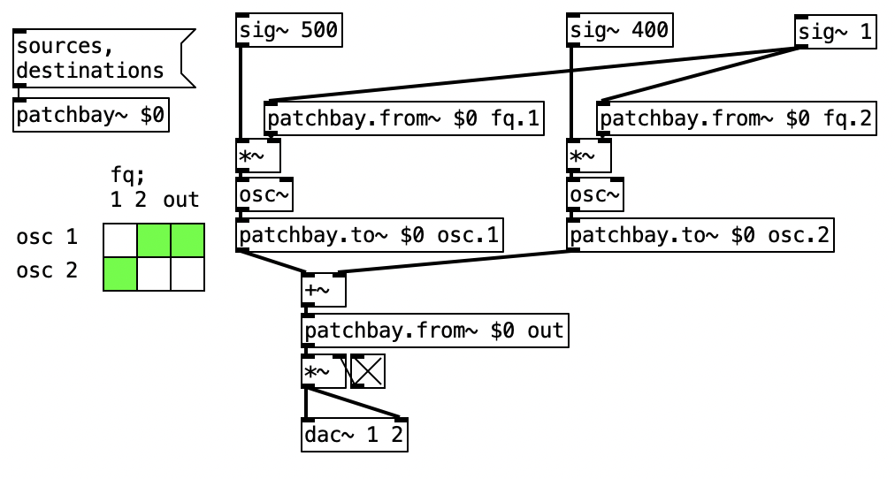

# pd-patchbay [alpha]

> [!IMPORTANT]  
> This is a prototype version of the `[patchbay~]` Pure Data library.
> It is usable out-of-the-box already, but has certain limitations.

Externals for dynamic audio patching using a patchbay-like interface.
- `[patchbay~]`: create your patchbay.
- `[patchbay.to~]`: send signal to patchbay inlet.
- `[patchbay.from~]`: receive signal from patchbay outlet.
- `[patchbay.matrix]`: control the signal flow within your patchbay.

## Why do you need it?

Objects from `[patchbay~]` family offer a patchbay-like workflow for signal routing.
While other existing tools definitely offer a signal routing matrices (like `iemguts` or `ELSE`),
`[patchbay~]` started as an architecture for _semimodular_ setups, where default signal flow is already defined
but with additional possibility of further routing.

> [!NOTE]  
> If you know of other projects using the concept of patchbays (or your created one yourself), please let me know!
> I would be very happy on creating a small article about existing solutions for patchbay workflows in Pure Data
> and I would gladly mention your work!

## How to use it?

1) Create a uniquely named `[patchbay~]` object.
1) Define sources and destinations using `sources` and `destinations` messages sent your `[patchbay~]`.
2) Send and receive signals from patchbay using `[patchbay.to~]` and `[patchbay.from~]` objects.
3) Create fixed default connections for semi-modular architecture.
4) Change internal routing using messages or `[patchbay.matrix]` responsive graphical interface.

You can create multiple patchbays in your project!
All the objects from `[patchbay~]` refering to the same name adress the same patchbay.
For example, a patchbay `[patchbay~ my-patchbay-$0]` can be accessed using `[patchbay.to~ my-patchbay-$0 node-name]`
and `[patchbay.from~ my-patchbay-$0 node-name]` and manipulated using `[patchbay.matrix my-patchbay-$0]`.

### Feedback!

Internally, the `[patchbay.to~]` and `[patchbay.from~]` use objects from `send~/receive~` and `throw~/catch~` vanilla objects.
Because they introduce some delay to the signal, you can safely create feedback systems!

### Including `[patchbay~]` in your existing project

I desinged `[patchbay~]` to be easily implemented in your existing project. Let's say your project looks like this:

The easiest way to add a patchbay workflow is to:
1) create and name a `[patchbay~]` object,
2) "inject" the `[patchbay.to~]` into your signal chain,
3) add one `[patchbay.from~]` at the end of your signal chain (we want at least one output,
4) create a `[patchbay.matrix]` to check if everything works correctly,

 
5) think carefully where to put the `[patchbay.from~]` receivers to make most out of your enhanced project (see below)!
6) re-create the `[patchbay.matrix]` to update its GUI, check if everything work as expected and start patch`[bay]`ing!

> [!TIP]  
> Let's be honest: nothing is more straightforward that patching objects directly.
> While solutions like this `[patchbay~]` aim at making your signal routing more flexible,
> they always add some additional complexity to your patch.
> From my personal experience, planning a patchbay is always trickier than it looks
> and requires some non obvious routing that are problem specific.
> For example, often you will need to supply a `[sig~ 1]` to `[patchbay.from~]` when using `[*~]` objects 
> in order not to cancel your modulated signal when nothing is connected.

## Future updates

I am working now on an update that will empower dynamic creation of patch nodes
and give the user more control to the `[patchbay.matrix]` display.

Planned updates to `[patchbay.matrix]` object:
- sync with updates to `[patchbay~]` (DONE),
- update GUI dynamically when adding or removing `[patchbay~]` nodes (DONE),
- display default connections (WIP),
- display partial gains as fading green color (DONE),
- attenuverter functionality (dragging mouse like a `[vslider]` will cause continuous gain change) (DONE),
- display names of inputs and outputs (DONE),
- adjustable boxes width (fixed size or to the length of the IO label) (DONE).
- display names of groups (WIP).

Planned updates to `[patchbay~]` object:
- dynamic registration of new nodes by simply creating `[patchbay.to~]` and `[patchbay.from~]` objects (DONE),
- retaining correct patch gains while removing or adding new nodes (WIP).
- modulate connection gain using signal (WIP).

> [!WARNING]  
> Multichannel support is not yet implemented.

One more thing is to add an alias `[pb~]` if one prefers brevity over clarity, your pure data weirdoos.

Also, planning more objects! But not too much not to keep it too bloated. It should be a simple library!
They should deal with:
- feedback or self-modulation,
- connection's gain modulation using signal,
- purely control messages.
